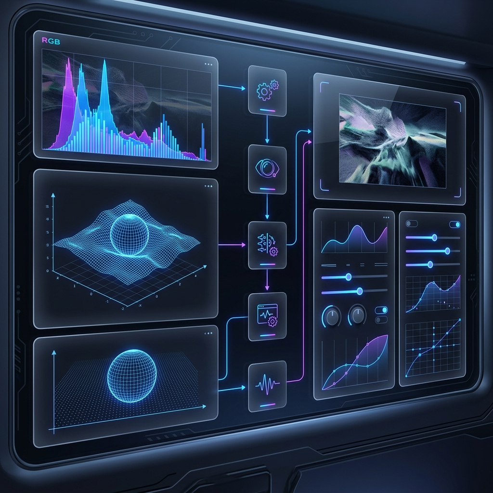
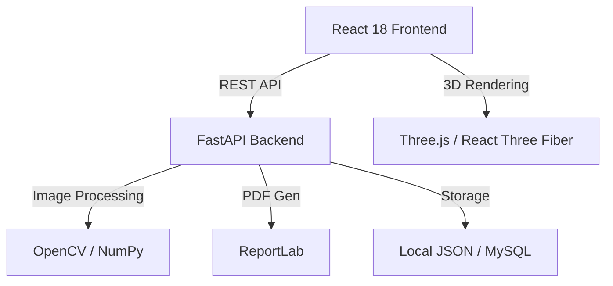

# 🔬 DIP Learning Simulator

<div align="center">



[](https://github.com/Nishanthnaik21/DIP_learning_simulator/blob/main/LICENSE)
[](https://www.python.org/)
[](https://fastapi.tiangolo.com/)
[](https://reactjs.org/)
[](https://opencv.org/)

**The Ultimate Interactive Platform for Mastering Digital Image Processing**

*An immersive, full-stack educational environment featuring 5 core modules, 19 advanced tools, and a high-performance interactive dashboard.*

[Explore Modules](#-core-modules) • [Try Advanced Tools](#-advanced-tools) • [Getting Started](#-getting-started)

</div>

---

## 🌟 Key Highlights

- **🚀 Modern React Dashboard**: A sleek, glassmorphic interface for tracking processed images, tool history, and performance metrics.
- **🧠 Intelligent Code Explainer**: Line-by-line interactive analysis of complex DIP algorithms (OpenCV/NumPy/Matlab).
- **📊 Professional Lab Reports**: Automated generation of high-quality PDF reports with experimental data and visual results.
- **🎮 Interactive 3D Scenes**: Immersive 3D visualizations built with Three.js to explore image fundamentals and spatial concepts.
- **🛠️ Recommended Tools**: Quick-access suite featuring Super Resolution, Webcam Filters, Comparison Sliders, and more.

---

## 🧪 Core Modules

Dive deep into the curriculum with our structured interactive modules:

| Module | Core Topics | Highlights |
| :--- | :--- | :--- |
| **01. Fundamentals** | Sampling, Quantization, Color Spaces | Pixel Inspector, Bit-plane Slicing |
| **02. Spatial & Frequency** | Histograms, Smoothing, DFT, FFT | CLAHE, Butterworth Filters |
| **03. Restoration** | Noise Models, Wiener, Inverse Filter | PSNR/SSIM Metrics, Noise Removal |
| **04. Color & Morphology** | Pseudo-color, Wavelets, Erosion/Dilation | Hit-or-Miss, Multi-res Analysis |
| **05. Segmentation** | Edge Detection, Hough, Thresholding | Watershed, SIFT/ORB Descriptors |

---

## 🛠️ Advanced Tools

Our specialized toolset provides hands-on experience with real-world DIP applications:

- **🔍 Analysis**: Quality Metrics (PSNR), Feature Descriptors, Shape Analysis, ELA Forensics.
- **⚡ Processing**: Super Resolution, JPEG Compression, GIF Animator, Image Stitching.
- **🎥 Real-time**: Webcam Filters, Optical Flow, Document Scanner.
- **📝 Workflow**: Code Exporter, Session Recorder, Lab Report Generator, Quiz Mode.
- **🧪 Experimental**: Parameter Challenge, Template Matching, Batch Processing.

---

## 🚀 Getting Started

### Prerequisites
- Node.js (v18+)
- Python (3.10+)
- MySQL (Optional for cloud persistence)

### Installation

1. **Clone the Project**
   ```bash
   git clone https://github.com/Nishanthnaik21/DIP_learning_simulator.git
   cd DIP_learning_simulator
   ```

2. **Backend Setup**
   ```bash
   cd backend
   pip install -r requirements.txt
   python -m uvicorn main:app --reload --port 8000
   ```

3. **Frontend Setup**
   ```bash
   cd ../frontend
   npm install
   npm run dev
   ```

---

## 🏗️ Architecture



---

## 📁 Project Structure

- **`frontend/`**: Vite-powered React application with Framer Motion animations and Three.js scenes.
- **`backend/`**: FastAPI server handling authentication, image processing logic, and report generation.
- **`assets/`**: Project documentation assets and hero images.
- **`utils/`**: Shared helper functions for DIP algorithms and database management.

---

## 🔑 Access Credentials

| Role | Username | Password |
| :--- | :--- | :--- |
| **Admin** | `admin` | `dip2024` |
| **Student** | `student` | `learn123` |
| **Guest** | `guest` | `guest` |

---

## 📜 License

Distributed under the **MIT License**. See `LICENSE` for more information.

<div align="center">
  <br />
  Built with ❤️ by the DIP Simulator Team
</div>
